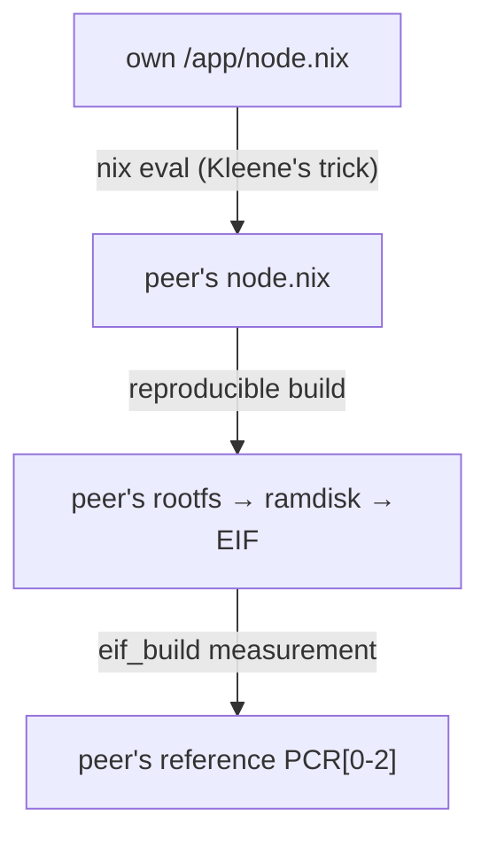

# Mutual Quine as two AWS Nitro Enclaves — PCRs edition

> Looking for a gentler start? [`mutual_quine_ne_sha`](../mutual_quine_ne_sha/README.md) is the lighter sibling of this example: the enclaves only compute the SHA-384 digest of each other's *source*, without the in-enclave EIF rebuild performed here.

This tutorial builds **two Nitro Enclave image files (EIFs)** such that, at runtime, *each enclave prints the reference PCR values of the other* — without ever talking to the other enclave, the host, or the network.
Everything an enclave needs to know about its peer is embedded in its own image.
It is established by combining:

- **NixReflect** (this repo) — resolves the mutual-reference fixed point à la Kleene's second recursion theorem, exactly like the `mutual_quine` example in [PyReflect](https://github.com/acompany-develop/PyReflect); and
- **[monzo/aws-nitro-util](https://github.com/monzo/aws-nitro-util)** — builds EIFs *bit-for-bit reproducibly* with Nix, which is what makes "compute the peer's PCRs yourself" meaningful.

## Background

In Nitro Enclaves remote attestation, the attester (an enclave) has the **Nitro Security Module (NSM)** issue an **attestation document**.
The verifier first checks the document's authenticity against the **AWS Nitro root CA certificate**, then matches the PCRs it carries against **reference values** to confirm that the expected image is running; PCR0–2 are the measurements (SHA-384 digests) of the EIF.
(See [Humane-RAFW-NE](https://github.com/acompany-develop/Humane-RAFW-NE) for a detailed walk-through of this flow.)
The verifier must therefore hold the attester's reference PCR values in advance.

Now let several enclaves attest *each other*: each peer must hold the other's reference PCRs.
The naïve hardcoding approach cannot realise this:

- embedding B's PCR values in A's image changes A's contents, hence A's PCRs;
- that forces an update of the values embedded in B, changing B's PCRs;
- that forces an update of the values embedded in A — *ad infinitum*.

Existing approaches therefore delegate the problem to a **trusted third party (TTP)** entrusted with recording and delivering each peer's reference PCRs — a *reference value provider* in [RATS (RFC 9334)](https://doi.org/10.17487/RFC9334) terms.

This example is a **PoC that drops the TTP**: by combining **Kleene's second recursion theorem** with **reproducible builds**, each node *recomputes* its peers' reference PCR values by itself.
An image embeds neither the peer's PCRs nor the peer's image.
Instead, each embeds the *generator* of the Nix source.
The generator reconstructs the exact source of both nodes.
Each enclave builds the peer's EIF from its recomputed source *reproducibly*, and measures the EIF at runtime:



## Image layout

Both EIFs are assembled by `aws-nitro-util` from:

| EIF section | content | node1 vs node2 |
| --- | --- | --- |
| kernel + cmdline | AWS-provided blob | identical |
| bootstrap ramdisk | `init` (compiled from source) + `nsm.ko` + `/node-id` | **differs in `/node-id`** |
| user ramdisk | `/env`, `/cmd`, `/rootfs/**` | **differs in exactly one file** |

The user ramdisk's rootfs contains:

- `/nix/store/**` — the closure of the tool set the enclave needs at runtime (`bash`, `coreutils`, `findutils`, `cpio`, `gzip`, `jq`, `nix`, `eif_build`) plus a `payload` of byte-copies of the EIF build inputs (kernel, kernel config, **both** bootstrap ramdisks, `/env`/`/cmd` texts).
  Identical for both.
- `/app/run` — the entrypoint (identical),
- `/app/closure.txt` — the store-path list (identical),
- `/app/node.nix` — the NixReflect-transpiled quine node.
  **The only file that differs between the two user ramdisks.**

Every node-specific artifact (`/app/node.nix`, and which bootstrap ramdisk an image boots) is Quine-derivable, and every other build input is carried byte-for-byte inside each image — so the peer's EIF is a pure function of data each enclave already has.

At runtime `/app/run`:

1. evaluates `/app/node.nix` with `nix-instantiate` — the quine yields `{ self, peer, selfSource, peerSource, ... }`;
2. sanity-checks that `selfSource` is byte-identical to its own `/app/node.nix`;
3. re-stages the peer's rootfs (own closure + `peerSource` as `/app/node.nix`);
4. re-packs the user ramdisk with the *same* deterministic `cpio | gzip -n` recipe `aws-nitro-util` uses at build time;
5. re-runs `eif_build` with the same pinned inputs — selecting the *peer's* bootstrap ramdisk from the payload by node id — and prints the resulting `pcr.json`: the peer's reference PCRs.

Steps 3–5 mirror `rootfsFor` / `mkUserRamdisk` / `mkCpioArchive` / `mkEif` line by line; see the comments in [run.sh](run.sh) and [default.nix](default.nix).

### Reproducibility

The whole scheme stands on the EIF build being a *pure, pinned* function:

- `flake.lock` pins `nixpkgs`, `aws-nitro-util`, and (transitively) the exact derivations of every tool that participates in the rebuild, on the host and inside the enclaves alike.
  **Commit `flake.lock` and keep it fixed**: the two images and the in-enclave rebuild must all come from the same lock.
- The very same store paths that build the images are copied *into* the images, so the in-enclave rebuild runs the same `cpio`, `gzip`, and `eif_build` binaries, bit for bit, that the host used.
- `aws-nitro-util` zeroes timestamps and build metadata, making `image.eif` itself deterministic.

## Prerequisites

- **Build machine**: any `x86_64-linux` or `aarch64-linux` machine (or VM) with [Nix](https://nixos.org/download) and flakes enabled.
  Building on the Nitro EC2 host itself is simplest — the enclave architecture then matches automatically.
  On macOS, use a [linux-builder](https://nixos.org/manual/nixpkgs/stable/#sec-darwin-builder).
- **Run machine**: an EC2 instance with Nitro Enclaves enabled.
  The instance's architecture must match the EIF's (`x86_64` EIF ⇔ `x86_64` instance).

### Host setup

1. Install Nix (multi-user) and enable flakes:

   ```bash
   curl -fsSL https://install.determinate.systems/nix | sh -s -- install
   # or the official installer:
   #   sh <(curl -fsSL https://nixos.org/nix/install) --daemon
   #   echo 'experimental-features = nix-command flakes' | sudo tee -a /etc/nix/nix.conf
   #   sudo systemctl restart nix-daemon
   ```

2. Install Docker, the Nitro Enclaves driver, and `nitro-cli` **v1.4.5, pinned to commit `18a5f6f35f110c0f235f193ae3caff9434d64ee1`** (adapted from [Humane-RAFW-NE's setup scripts](https://github.com/acompany-develop/Humane-RAFW-NE/tree/main/scripts)):

   ```bash
   ./scripts/setup-nitro-cli.sh   # runs ./scripts/setup-docker.sh as its first step
   ```

   The script is idempotent and leaves a state that survives reboots: the driver auto-loads (`modules-load.d`), `/run/nitro_enclaves` is recreated at boot (`tmpfiles.d`, otherwise `nitro-cli` fails with `E07`), the allocator service is enabled, and `/dev/nitro_enclaves` is opened to the `ne` group — after re-login, no `sudo` is needed for `nitro-cli`.

   It also reserves allocator resources for this demo (the enclaves rebuild an EIF in RAM, so be generous): 8192 MiB / 2 CPUs by default, tunable via `ALLOCATOR_MEMORY_MIB` / `ALLOCATOR_CPU_COUNT` environment variables.

   The host side is deliberately a shell script, not Nix: it manages kernel modules, udev, and systemd units on a foreign distro, which Nix cannot do declaratively outside NixOS.
   Everything after this point — building the EIFs and their in-enclave reconstruction — is pure, pinned Nix.

### Tested environment

Last verified end to end on **2026-07-29**, on both **x86\_64** and **AArch64**: both enclaves booted on real Nitro hardware, and the PCRs each reconstructed for its peer matched both the peer's build-time `pcr.json` and the values the hypervisor reports (`nitro-cli describe-enclaves --metadata`) for a non-debug run of the peer.
(PCR values are architecture-specific; the sample outputs under [Run](#run) are from the AArch64 host.)

#### x86\_64 host

| item | value |
| --- | --- |
| Instance type | `m6a.xlarge` (4 vCPU / 16 GiB RAM; AMD EPYC 7R13, 2 threads/core), **Nitro Enclaves: enabled** |
| AMI | `ubuntu/images/hvm-ssd-gp3/ubuntu-resolute-26.04-amd64-server-20260604` (`ami-0e5497a77ef21b5ac`, us-east-2) |
| OS / Kernel | Ubuntu 26.04 LTS / 7.0.0-1006-aws |
| Storage | 64 GiB |
| Enclave allocator | `memory_mib: 8192`, `cpu_count: 2` (2 of the 4 vCPUs reserved for enclaves) |
| nitro-cli | 1.4.5 (commit `18a5f6f35f110c0f235f193ae3caff9434d64ee1`) |
| Docker | 29.1.3 (`docker.io` 29.1.3-0ubuntu4.1) |
| Nix (host) | Determinate Nix 3.21.8 (Nix 2.34.8), flakes enabled |

#### AArch64 host

| item | value |
| --- | --- |
| Instance type | `m6g.xlarge` (4 vCPU / 16 GiB RAM; AWS Graviton2, Neoverse-N1, 1 thread/core), **Nitro Enclaves: enabled** |
| AMI | `ubuntu/images/hvm-ssd-gp3/ubuntu-resolute-26.04-arm64-server-20260604` (`ami-04d0f56e9ce314a8e`, us-east-2) |
| OS / Kernel | Ubuntu 26.04 LTS / 7.0.0-1006-aws |
| Storage | 64 GiB |
| Enclave allocator | `memory_mib: 8192`, `cpu_count: 2` (2 of the 4 vCPUs reserved for enclaves) |
| nitro-cli | 1.4.5 (commit `18a5f6f35f110c0f235f193ae3caff9434d64ee1`) |
| Docker | 29.1.3 (`docker.io` 29.1.3-0ubuntu4.1) |
| Nix (host) | Determinate Nix 3.21.8 (Nix 2.34.8), flakes enabled |

#### Enclaves

Build inputs, pinned by `flake.lock` — these fully determine the images and everything that runs *inside* the enclaves, so they hold on any build machine:

| input | pinned rev | supplies |
| --- | --- | --- |
| `nixpkgs` | `nixos-unstable` @ `624af66` | Python 3.12.13, which runs the transpiler at build time |
| `nitro-util` | [monzo/aws-nitro-util](https://github.com/monzo/aws-nitro-util) @ `b529ed6` | `mkEif` and friends, `eif_build`, `init`, the AWS kernel/`nsm.ko` blobs |
| `nitro-util/nixpkgs` | `d8fe5e6` | every tool packed into (and re-used inside) the images: Nix 2.18.2, bash 5.2p26, coreutils 9.4, `cpio`, `gzip`, `jq` |

A different lock — like a different architecture — will produce different (still internally consistent) PCRs; commit `flake.lock` and keep it fixed across the fleet.

## Run

### Step 1 — transpilation (optional)

From the repo root:

```bash
nix build .#mutual-quine-ne-pcrs-nodes -o nodes
cat nodes/node___ENCLAVE1.nix
```

You can also run the transpiler directly, without Nix:

```bash
PYTHONPATH=src python3 -m nixreflect examples/mutual_quine_ne_pcrs/template.json out/
```

Each node evaluates to `{ self, peer, selfSource, peerSource, peerSourceSha256 }`, reconstructed entirely from the JSON blob embedded in the node itself.

### Step 2 — EIF build

```bash
nix build .#mutual-quine-ne-pcrs-eif1 -o eif1
nix build .#mutual-quine-ne-pcrs-eif2 -o eif2

cat eif1/pcr.json   # node1's reference PCRs
cat eif2/pcr.json   # node2's reference PCRs
```

The first build compiles `eif_build` and `init` from source and downloads the pinned tool closure; subsequent builds are cheap.
Note `nix build` will always reproduce the same `image.eif` and `pcr.json` — that determinism is what the enclaves exploit.

### Step 3 — hardware-free verification

The flake ships checks that re-run **the exact enclave entrypoint** against each image's pristine rootfs and compare the PCRs it reconstructs for its peer with the peer's actual build:

```bash
nix build .#checks.$(nix eval --raw --impure --expr builtins.currentSystem).mutual-quine-ne-pcrs-verify-1-rebuilds-2
nix build .#checks.$(nix eval --raw --impure --expr builtins.currentSystem).mutual-quine-ne-pcrs-verify-2-rebuilds-1
# or simply:
nix flake check
```

If these pass, what the enclaves will print on real hardware is already determined to be correct.

### Step 4 — run on Nitro Enclaves

The sample outputs below are actual values measured on the AArch64 host of the [tested environment](#tested-environment) with the committed `flake.lock`; your run reproduces them bit for bit as long as the lock is unchanged and the architecture matches (an x86\_64 run yields different, equally reproducible values).

**Enclave 1** — boot it and attach to its console:

```bash
nitro-cli run-enclave \
  --eif-path eif1/image.eif \
  --memory 8192 --cpu-count 2 \
  --debug-mode

nitro-cli console --enclave-id "$(nitro-cli describe-enclaves | jq -r '.[0].EnclaveID')"
```

After boot, enclave 1 evaluates its quine, rebuilds its peer, and prints:

```console
==[ NixReflect mutual quine -- Nitro Enclave edition ]==
warning: the group 'nixbld' specified in 'build-users-group' does not exist
self: __ENCLAVE1
peer: __ENCLAVE2
self-render is byte-identical to /app/node.nix

==[ reference PCRs for peer enclave __ENCLAVE2 ]==
{
  "HashAlgorithm": "Sha384 { ... }",
  "PCR0": "46c149390da0e5d0ec62945ed5d74931b08e257a9dba5168404c8c188d24eea1c21d82523cb316346af4701b24d1ac54",
  "PCR1": "dedb7471a4bbc7b6b8716cef81429c270c0ecb6c401e24c7c8c467adee43dc9656077d648e0139f2996bb1e5c5d342f8",
  "PCR2": "640ce90e3cdbf9956845284ec1a5cc4c10fcff1a589d35e31256224bad051e1a93b907444386afa2b4bae4d0a20e79c2"
}

compare against the peer's build-time pcr.json and its (non-debug) attestation document.
```

These are exactly `eif2/pcr.json`'s values.
Terminate it:

```bash
nitro-cli terminate-enclave --all
```

**Enclave 2** — same commands with `eif2/image.eif`:

```bash
nitro-cli run-enclave \
  --eif-path eif2/image.eif \
  --memory 8192 --cpu-count 2 \
  --debug-mode

nitro-cli console --enclave-id "$(nitro-cli describe-enclaves | jq -r '.[0].EnclaveID')"
```

```console
==[ NixReflect mutual quine -- Nitro Enclave edition ]==
warning: the group 'nixbld' specified in 'build-users-group' does not exist
self: __ENCLAVE2
peer: __ENCLAVE1
self-render is byte-identical to /app/node.nix

==[ reference PCRs for peer enclave __ENCLAVE1 ]==
{
  "HashAlgorithm": "Sha384 { ... }",
  "PCR0": "25ab88a08497a612730a544d43b7915f833c49cf2f61fbbc99d4b27a578369c3796de241c5c8c7dcc96506515a23abe1",
  "PCR1": "d03d2dda4749caa29cc6d866e2d68d6af682b6f8620b80b929c8ddbc898d88f622c260b6fcdd4ee06b10790e490c5099",
  "PCR2": "0658d33092eb2744b4110c06f56ec77981793e5ce88cc10fdf888119b2b16f31504c553f5485d12e47ab6ccef1407118"
}

compare against the peer's build-time pcr.json and its (non-debug) attestation document.
```

— and these are exactly `eif1/pcr.json`'s values, the same measurements the Nitro hypervisor reports for a (non-debug) run of enclave 1 (`nitro-cli describe-enclaves --metadata`).
Each enclave derived, from itself alone, exactly the measurements the hypervisor attests for the other.
Note the two enclaves share none of PCR0/1/2 — the node-specific bootstrap ramdisk splits PCR1 as well.

```bash
nitro-cli terminate-enclave --all
```

## Next steps

The printed values are *reference* PCRs — precisely what you need to verify an **attestation document**.
A natural next step is to connect the two enclaves over vsock, exchange NSM attestation documents, and have each enclave verify the other's document against the PCRs it computed for itself here: mutual remote attestation with no externally provisioned measurement policy at all.

## Notes

- **`--debug-mode`** lets you read the console, but the *attestation document* of a debug enclave reports zeroed PCRs.
  The console output (the peer's reference values) is unaffected; run without `--debug-mode` for real attestation.
- **Memory**: the enclave copies its tool closure, restages the peer's rootfs and packs an EIF in RAM.
  8 GiB is comfortable; shrink `appEnv` if you need less.
- The runtime rebuild in `run.sh` mirrors `aws-nitro-util`'s `mkUserRamdisk`, `mkCpioArchive` and `mkEif` recipes.
  If you bump the `nitro-util` input, re-run `nix flake check` — it will catch any drift between the two.
- `verify` also byte-compares the reconstructed `image.eif` with the built one.
  PCR equality is the load-bearing check; EIF metadata is not measured.

## References

- Acompany Co., Ltd., *PyReflect*, GitHub repository.
  <https://github.com/acompany-develop/PyReflect>
- Acompany Co., Ltd., *Humane-RAFW-NE*, GitHub repository.
  <https://github.com/acompany-develop/Humane-RAFW-NE>
- AWS. *User Guide - AWS Nitro Enclaves*.
  <https://docs.aws.amazon.com/pdfs/enclaves/latest/user/enclaves-user.pdf>
- D.-P. Dornseifer and B. Liderman, *Verify enclave counterparties with reproducible builds and cryptographic attestation using AWS Nitro Enclaves*, AWS Web3 Blog.
  <https://aws.amazon.com/blogs/web3/verify-enclave-counterparties-with-reproducible-builds-and-cryptographic-attestation-using-aws-nitro-enclaves/>
- IETF, *RFC 9334: Remote ATtestation procedureS (RATS) Architecture*.
  <https://doi.org/10.17487/RFC9334>
- Monzo. *AWS Nitro utilities*, GitHub repository.
  <https://github.com/monzo/aws-nitro-util>
